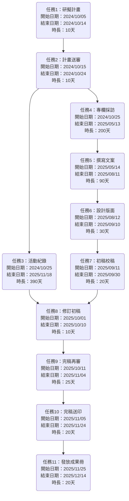
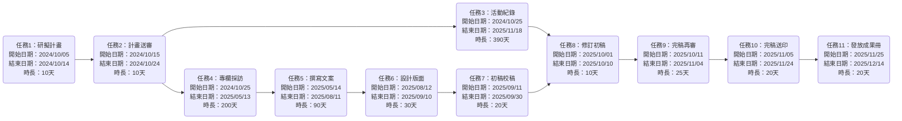
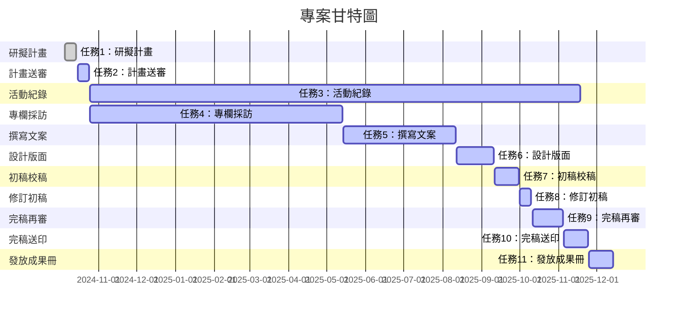

| 任務 | 說明        | 需時 (天) | 前置任務  |
| ---- | ----------- | --------- | --------- |
| 1    | 研擬計畫    | 10         | -         |
| 2    | 計畫送審    | 10         | 1         |
| 3    | 活動紀錄    | 390        | 2         |
| 4    | 專欄採訪    | 200        | 2         |
| 5    | 撰寫文案    | 90         | 4         |
| 6    | 設計版面    | 30         | 5         |
| 7    | 初稿校稿    | 20         | 6         |
| 8    | 修訂初稿    | 10         | 3, 7      |
| 9    | 完稿再審    | 25         | 8         |
| 10   | 完稿送印    | 20         | 9         |
| 11   | 發放成果冊  | 20         | 10        |

