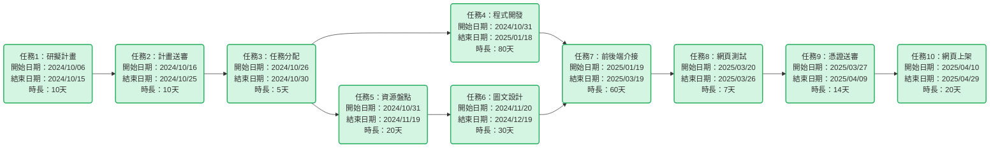
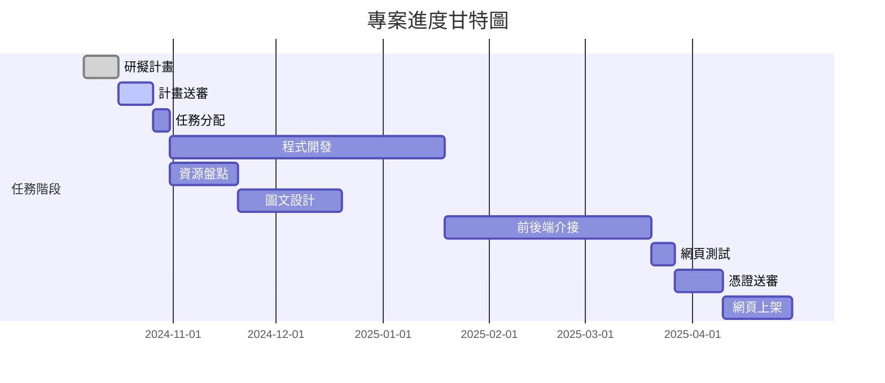

| 任務 | 說明        | 需時 (天) | 前置任務  |
| ---- | ----------- | --------- | --------- |
| 1    | 研擬計畫    | 10         | -         |
| 2    | 計畫送審    | 10         | 1         |
| 3    | 任務分配    | 5          | 2         |
| 4    | 程式開發    | 80         | 3         |
| 5    | 資源盤點    | 20         | 3         |
| 6    | 圖文設計    | 30         | 5         |
| 7    | 前後端介接  | 60         | 4, 6       |
| 8    | 網頁測試    | 7          | 7         |
| 9    | 憑證送審    | 14         | 8         |
| 10   | 網頁上架    | 20         | 9         |

